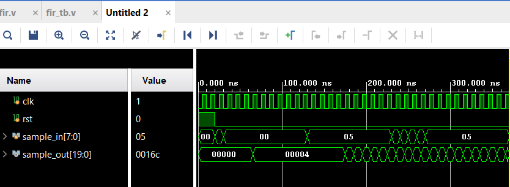

# VLSI_FIR
# VLSI_FIR_Filter
# Finite Impulse Response (FIR) Filter in Verilog
This project implements a **configurable FIR Filter** in Verilog with a comprehensive testbench.  
It demonstrates **digital signal processing** concepts using **multiply-accumulate operations** and **shift register architecture**.

---

## 📂 Files Included
- **fir.v** → Main FIR filter module with parameterizable taps and bit width  
- **fir_tb.v** → Testbench with impulse, step, and ramp input testing  
- **waveform.png** → Vivado simulation waveform showing filter response  

---

## ⚙️ Features
- **Parameterizable design**: Configurable number of taps (N) and input bit width  
- **Signed arithmetic**: Full signed multiplication and accumulation  
- **Shift register architecture**: Efficient sample delay implementation  
- **Configurable coefficients**: Easy coefficient modification for different filter responses  
- **Wide output**: `2*WIDTH+3` bits to prevent overflow in accumulation  

---

## 🏗️ Architecture

### Filter Structure
```
Input ──► [Shift Register] ──► [Multiply & Accumulate] ──► Output
         [  z⁻¹  z⁻¹  z⁻¹ ]    [   c₀  c₁  c₂  c₃   ]
```

### Default Configuration
- **Number of taps (N)**: 4
- **Input width**: 8 bits  
- **Output width**: 19 bits (2*8+3)
- **Coefficients**: [1, 2, 3, 4] (example values)

### Transfer Function
```
H(z) = c₀ + c₁z⁻¹ + c₂z⁻² + c₃z⁻³
```

---

## 📝 Simulation Results

### Test Sequence
```verilog
// Reset phase
rst = 1, sample_in = 0

// Impulse response test  
sample_in = 1, then 0

// Step response test
sample_in = 5 (constant)

// Ramp input test
sample_in = 1, 2, 3, 4, 5 (increasing)
```

### Waveform Analysis
- **clk** → System clock (100 MHz, 10ns period)
- **rst** → Active high reset signal  
- **sample_in[7:0]** → 8-bit signed input samples
- **sample_out[19:0]** → 20-bit signed filter output



### Expected Responses
| Input Type | Description | Expected Output |
|------------|-------------|-----------------|
| Impulse | δ[n] = 1, 0, 0... | Coefficients: 1, 2, 3, 4 |
| Step | u[n] = 5, 5, 5... | Accumulating: 5, 15, 30, 50 |
| Ramp | 1, 2, 3, 4, 5... | Convolution result |

---

## 🚀 Running the Simulation

### Using Vivado
```tcl
# Create new project
create_project fir_filter ./fir_filter -part xc7a35tcpg236-1

# Add source files
add_files -norecurse {fir.v fir_tb.v}

# Set testbench as simulation source
set_property top fir_tb [get_filesets sim_1]

# Run behavioral simulation
launch_simulation
run all
```

### Alternative Simulators
```bash
# Using ModelSim
vlog fir.v fir_tb.v
vsim -c fir_tb -do "run -all; quit"

# Using Icarus Verilog  
iverilog -o fir_filter fir.v fir_tb.v
vvp fir_filter
```

---

## 🔧 Customization

### Changing Filter Parameters
```verilog
// Modify module instantiation
fir #(.N(8), .WIDTH(16)) my_filter (
    .clk(clk),
    .rst(rst), 
    .sample_in(sample_in),
    .sample_out(sample_out)
);
```

### Custom Coefficients
```verilog
// In fir.v, modify the initial block
initial begin
    coeff[0] = 8'sd10;   // Low-pass filter example
    coeff[1] = 8'sd25;
    coeff[2] = 8'sd25; 
    coeff[3] = 8'sd10;
end
```

---

## 📌 Applications
- **Digital signal processing** - Audio/video filtering applications
- **Communication systems** - Channel equalization and noise reduction  
- **FPGA/ASIC design** - Real-time signal processing implementations
- **DSP education** - Understanding filter design and implementation
- **Embedded systems** - Software-defined radio and sensor processing

---

## ⚠️ Design Notes
- **Timing consideration**: Single-cycle multiply-accumulate may limit maximum frequency
- **Resource usage**: Each tap requires one multiplier and adder
- **Overflow protection**: Output width sized to prevent accumulator overflow
- **Pipeline opportunity**: Can be pipelined for higher throughput applications

---

## 🧑‍💻 Author
- **Saurabh Kamble**  
- **[https://github.com/Ayanokouji707](https://github.com/Ayanokouji707)**
